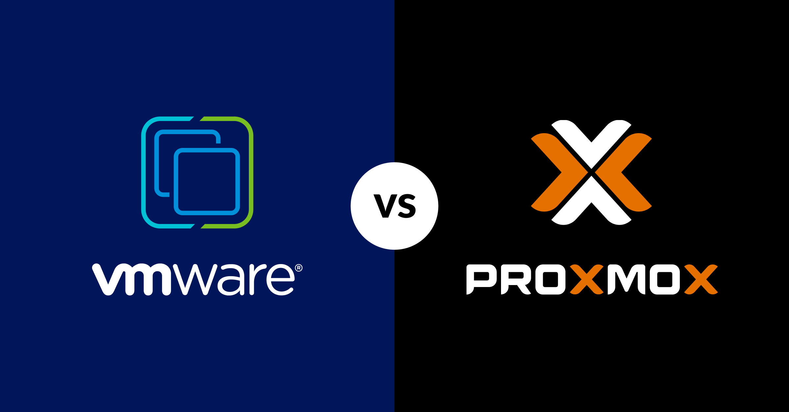
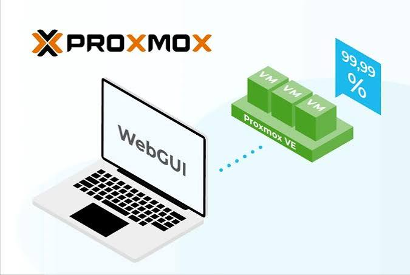
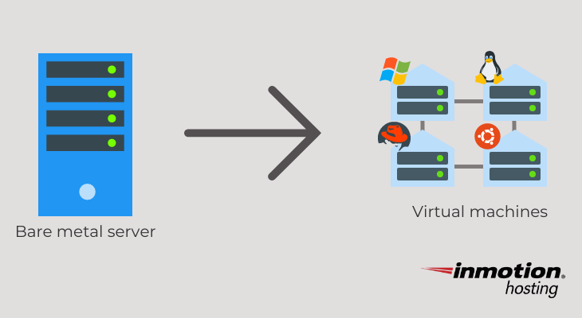
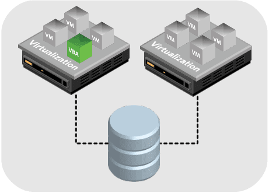
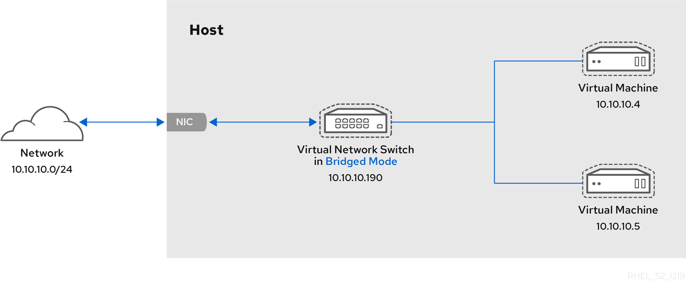
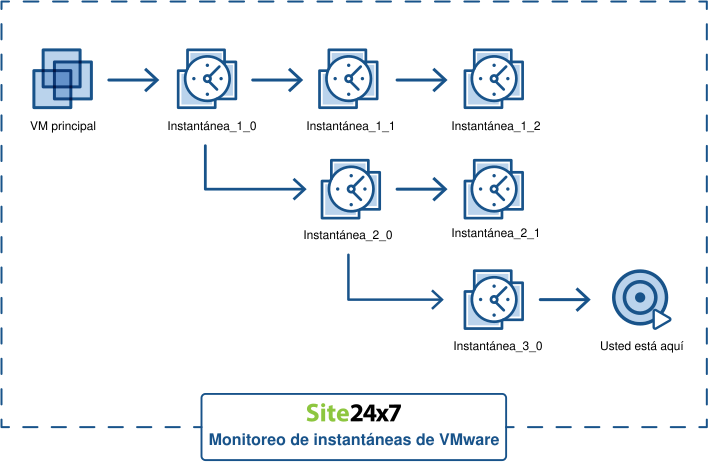
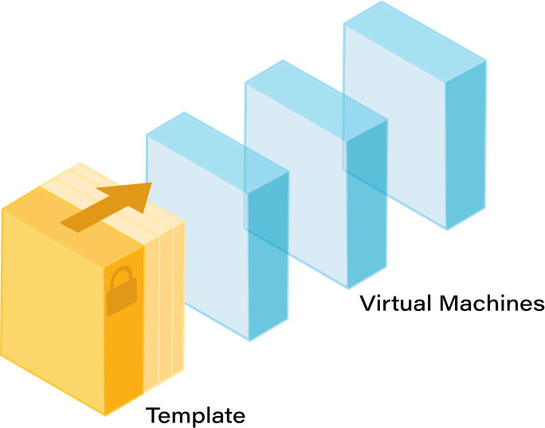

# Bloque 1 — Proxmox

### Por qué existe y qué problema resuelve

Con VirtualBox, el sistema operativo base ya consume RAM y CPU de fondo, y VirtualBox reparte entre las VMs lo que sobra. Para un proyecto que necesitamos **10 o más VMs corriendo a la vez**, esto es ineficiente e insuficiente.

**Proxmox** elimina esa capa intermedia, se instala como si fuera el propio sistema operativo del PC. No hay "Windows + programa de virtualización" — hay un servidor dedicado exclusivamente a crear y gestionar máquinas virtuales.&#x20;

Todo el hardware (RAM, CPU, disco) se reparte directamente entre las VMs y se gestiona automáticamente.

<figure><figcaption></figcaption></figure>

### Conceptos clave



**Node**: el PC físico.

<figure><figcaption></figcaption></figure>



**VM (máquina virtual)**: un ordenador completo simulado, con su propia CPU asignada, RAM, disco virtual y sistema operativo instalado desde cero, permite instalar Ubuntu, pfSense, Kali, lo que sea.

<figure><figcaption></figcaption></figure>



**Storage**: dónde se guardan los discos virtuales de las VMs.

<figure><figcaption></figcaption></figure>



**Bridge:** un bridge es un **switch virtual,** cuando se conecta la tarjeta de red de una VM a un bridge, esa VM queda en la misma red que cualquier otra VM conectada al mismo bridge.

<figure><figcaption></figcaption></figure>



**Snapshot**: una foto congelada del estado completo de una VM.&#x20;

Si algo se rompe probando, se restaura el snapshot y se vuelve atrás en segundos sin reinstalar nada.

<figure><figcaption></figcaption></figure>



**Template**: una VM "maestra" ya configurada que se clona para crear VMs nuevas rápidamente.&#x20;

Por ejemplo: instalar Ubuntu Server una vez, dejarlo limpio y actualizado, convertirlo en template, y clonar desde ahí cada vez que se necesite una VM Ubuntu nueva.

<figure><figcaption></figcaption></figure>



### Cómo se ve en la práctica

Todo se gestiona desde el navegador, accediendo a `https://IP-DEL-PC:8006`.

<figure><figcaption></figcaption></figure>
