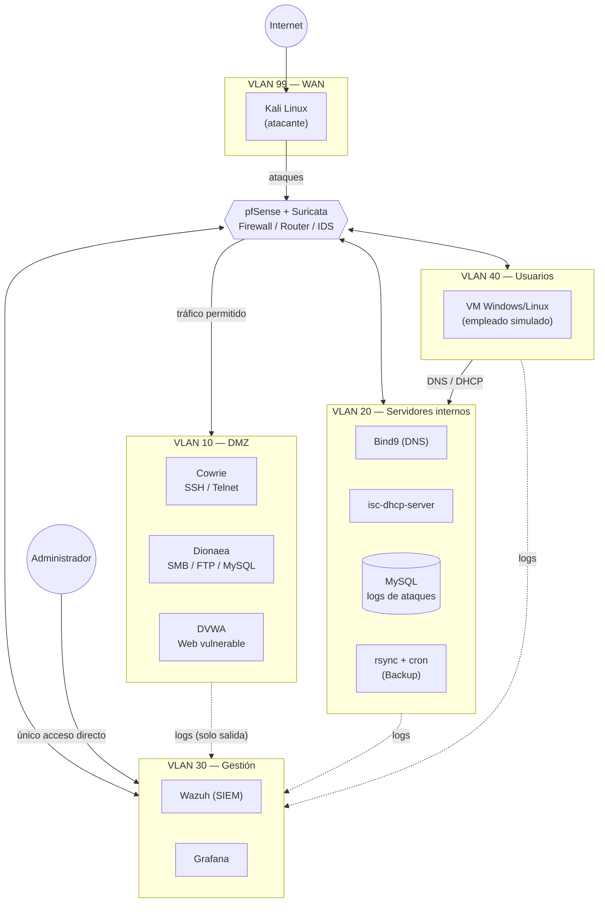

# 🌐 Diagrama de red

## Diagrama de red

### Introducción

Esquema general de la arquitectura de **HoneyNet**: un único PC con **Proxmox** como hipervisor, cinco VLANs segmentadas por **pfSense + Suricata**, y el flujo de tráfico permitido entre ellas.

***

### Esquema general

***

### Reglas de tráfico (leyenda del diagrama)

<table data-search="false"><thead><tr><th>Origen</th><th>Destino</th><th>¿Permitido?</th><th>Motivo</th></tr></thead><tbody><tr><td>WAN (Kali)</td><td>DMZ, vía pfSense</td><td>✅ Sí</td><td>Es el tráfico que el proyecto busca atraer y capturar</td></tr><tr><td>WAN (Kali)</td><td>Servidores / Gestión / Usuarios</td><td>❌ No</td><td>pfSense nunca expone directamente las VLANs internas a la WAN</td></tr><tr><td>DMZ</td><td>Cualquier otra VLAN</td><td>❌ No (salvo logs)</td><td>Si un honeypot se compromete, debe quedar aislado</td></tr><tr><td>DMZ</td><td>Gestión</td><td>✅ Solo logs (un sentido)</td><td>Monitorización, no es tráfico de ataque</td></tr><tr><td>Servidores</td><td>Gestión</td><td>✅ Solo logs</td><td>Igual que el caso anterior</td></tr><tr><td>Usuarios</td><td>Servidores</td><td>✅ Sí</td><td>Consumo normal de DNS/DHCP</td></tr><tr><td>Usuarios</td><td>DMZ / Gestión</td><td>❌ No</td><td>Los empleados simulados no tienen motivo para tocar esas VLANs</td></tr><tr><td>Administrador</td><td>Gestión</td><td>✅ Único acceso directo</td><td>Es la VLAN más protegida de todas</td></tr></tbody></table>
