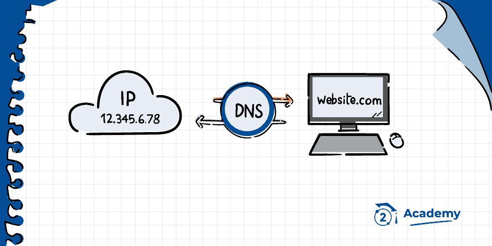

# DNS

### **¿ Qué es un DNS ?**

El sistema DNS es una **estructura jerárquica** a nivel mundial. Para administrar redes, primero debemos entender **quién gestiona** cada parte del pastel.

<figure><figcaption></figcaption></figure>

El organismo internacional que rige la arquitectura global de internet es la **ICANN** (_Internet Corporation for Assigned Names and Numbers_).

A través de su autoridad operativa, la **IANA** (_Internet Assigned Numbers Authority_), esta entidad sin ánimo de lucro desempeña un rol fundamental en la estandarización y el direccionamiento digital:

* _**Gestión del Sistema de Nombres de Dominio (DNS)**_: Regula la infraestructura de los dominios de nivel superior (como los códigos de país y genéricos), garantizando que la resolución de nombres en la red sea universal y coherente.
* _**Asignación de Direcciones IP:**_ Administra los bloques de direcciones IP (IPv4 e IPv6) y los identificadores de protocolos.

### Jerarquía y Tipos de DNS

La resolución de un dominio se realiza a través de una jerarquía de cuatro tipos de servidores DNS:

* **Servidores recursivos**: Reciben tu consulta inicial (ej. mi proveedor de internet) y buscan la dirección IP navegando por la red hasta encontrarla.
* **Servidores raíz**: El consejo de savios; redirigen la consulta según la extensión del dominio (como `.com` o `.es`).
* **Servidores TLD**: Gestionan extensiones específicas y guían hacia los servidores propios del sitio web.
* **Servidores autoritativos**: Tienen la información final y entregan la dirección IP exacta de la página que buscas.

<figure><figcaption></figcaption></figure>

### Herramientas OSINT: Whois y DNS Lookup

Las consultas Whois y los sistemas de resolución como DNS Lookup permiten auditar la infraestructura de cualquier dominio web mediante fuentes abiertas.

#### ¿Qué información ofrece Whois?

Una consulta Whois muestra los datos administrativos y técnicos asociados a un dominio, destacando:

* _**Titular y Registrador:**_ Quién es el propietario (a menudo protegido por el RGPD) y qué empresa comercial vendió el dominio.
* _**Fechas clave:**_ Creación, última actualización y fecha de caducidad.
* _**Configuración:**_ Los servidores de nombres (Name Servers) asignados y el estado operativo actual.

<figure><figcaption></figcaption></figure>

#### Registry vs. Registrar

_**Registry (Registro):**_ La organización central que administra una extensión concreta a nivel global o nacional (ej. Red.es para el .es). _**Mantiene la base de datos maestra**._

\
_**Registrar (Registrador):**_ La empresa comercial autorizada donde los usuarios compran y gestionan dominios (ej. GoDaddy o Namecheap), actuando como intermediario frente al Registry.

#### Seguridad con DNSSEC

El DNS tradicional es vulnerable a la suplantación de identidad o envenenamiento de caché, donde un atacante puede desviar el tráfico a webs maliciosas.&#x20;

**DNSSEC** (_Domain Name System Security Extensions_) soluciona este problema añadiendo firmas criptográficas a las respuestas del DNS, garantizando de forma matemática que los datos son auténticos y no han sido manipulados en el trayecto.

<figure><figcaption></figcaption></figure>

### Rendimiento DNS: DNS Benchmark

**DNS Jumper** es una herramienta gratuita para Windows que permite cambiar los servidores DNS con un solo clic y probar la velocidad de respuesta de diferentes proveedores para optimizar la conexión a internet.

* _**Orange DNS**_ (Reino Unido / Proveedor de telecomunicaciones)
  * IPs: `195.92.195.94` y `195.92.195.95`
  * Resultado: 0.7 milisegundos.
* _**Level 3 - B**_ (EE. UU. / Empresa de telecomunicaciones y redes IP globales)
  * IPs: `4.2.2.2` y `4.2.2.1`
  * Resultado: Entre 0.7 y 0.9 milisegundos.
* **Neustar 2** (EE. UU. / Proveedor de servicios de infraestructura y DNS)
  * IPs: `156.154.70.5` y `156.154.71.5`
  * Resultado: Entre 0.7 y 1 milisegundo.

<figure><figcaption></figcaption></figure>
